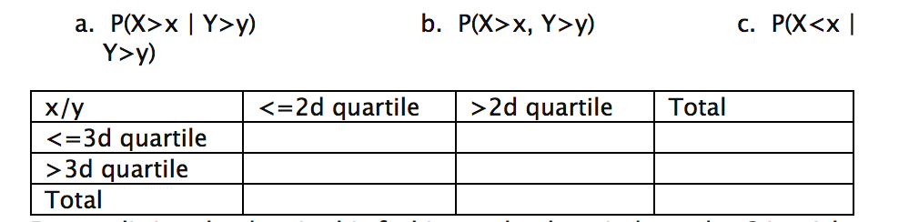

```{r setup, include=FALSE}
knitr::opts_chunk$set(echo = TRUE, comment=NA)
```

### Walt Wells, 07.31-08.11.2016

Data Science Math Bridge-Sample Final

Your Data Science Math final is due by the end of day on Sunday, August 8th. You should post your solutions AND VIDEO to your GitHub account.  You are also expected to make a short presentation during our last meeting (3 minutes).  This project will show off your ability to understand probability, statistics, linear algebra, and R.

Using the hflights package or another large (greater than 100,000 observations and 20 variables) dataset of your choosing, pick two quantitative variables (e.g., Arrival Delay and Departure Delay).  Define one of these variables as the random variable X and the other as the random variable Y.  One of these variables must be skewed to the right (positively)

<i>Probability.</i>  Calculate as a minimum the below probabilities a through d.  Assume the small letter "x" is estimated as the 3d quartile of the X variable, and the small letter "y" is estimated as the 2d quartile of the Y variable.  Interpret the meaning of all probabilities.  In addition, make a table of counts as shown below.


 
Does splitting the data in this fashion make them independent? Let A be the new variable counting those observations above the 3d quartile for X, and let B be the new variable counting those observations for the 2d quartile for Y.    Does P(A|B)=P(A)P(B)?   Check mathematically, and then evaluate by running a Chi Square test for association.

<i>Descriptive and Inferential Statistics.</i> Provide univariate descriptive statistics and appropriate plots.  Provide a scatterplot of the two variables.  Provide a 95% CI for the difference in the mean of the variables.  Derive a correlation matrix for two of the quantitative variables you selected.  Test the hypothesis that the correlation between these variables is 0 and provide a 99% confidence interval.  Discuss the meaning of your analysis.

<i>Linear Algebra and Correlation.</i>  Invert your correlation matrix. (This is known as the precision matrix and contains variance inflation factors on the diagonal.) Multiply the correlation matrix by the precision matrix, and then multiply the precision matrix by the correlation matrix. As an advanced option, conduct principle components analysis and interpret.  Discuss.

<i>Calculus-Based Probability & Statistics.</i>  Many times, it makes sense to fit a closed form distribution to data.  For your variable that is skewed to the right, shift it so that the minimum value is above zero.  Then load the MASS package and run fitdistr to fit an exponential probability density function.  (See  https://stat.ethz.ch/R-manual/R-devel/library/MASS/html/fitdistr.html ).  Find the optimal value of l for this distribution, and then take 1000 samples from this exponential distribution using this value (e.g., rexp(1000, l)).  Plot a histogram and compare it with a histogram of your original variable.   Using the exponential pdf, find the 5th and 95th percentiles using the cumulative distribution function (CDF).   Also generate a 95% confidence interval from the empirical data, assuming normality.  Finally, provide the empirical 5th percentile and 95th percentile of the data.  Discuss.