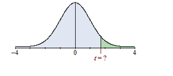

```{r setup, include=FALSE}
knitr::opts_chunk$set(echo = TRUE, comment=NA)
```
#### Walt Wells - 07.23-07.31.2016

### homework3.docx

1. The weights of steers in a herd are distributed normally.  The variance is 40,000 and the mean steer weight is 1300 lbs.  Find the probability that the weight of a randomly selected steer is greater than 979 lbs. (Round your answer to 4 decimal places)

``` {r}
sd <- sqrt(40000)
mean <- 1300
round(pnorm(979, mean, sd, lower.tail = FALSE), 4)
```

2. SVGA monitors manufactured by TSI Electronics have life spans that have a normal distribution with a variance of 1,960,000 and a mean life span of 11,000 hours.  If a SVGA monitor is selected at random, find the probability that the life span of the monitor will be more than 8340 hours. (Round your answer to 4 decimal places)

``` {r}
sd <- sqrt(1960000)
mean <- 11000
round(pnorm(8340, mean, sd, lower.tail = FALSE), 4)
```
 
3. Suppose the mean income of firms in the industry for a year is 80 million dollars with a standard deviation of 3 million dollars.  If incomes for the industry are distributed normally, what is the probability that a randomly selected firm will earn between 83 and 85 million dollars? (Round your answer to 4 decimal places)

``` {r}
sd <- 3
mean <- 80
round(pnorm(85, mean, sd) - pnorm(83, mean, sd), 4)
```

4. Suppose GRE Verbal scores are normally distributed with a mean of 456 and a standard deviation of 123.  A university plans to offer tutoring jobs to students whose scores are in the top 14%.  What is the minimum score required for the job offer?  Round your answer to the nearest whole number, if necessary.

``` {r}
mean <- 456
sd <- 123
round(qnorm(.86, mean, sd), 0)
```
 
5. The lengths of nails produced in a factory are normally distributed with a mean of 6.13 centimeters and a standard deviation of 0.06 centimeters.  Find the two lengths that separate the top 7% and the bottom 7%.  These lengths could serve as limits used to identify which nails should be rejected.  Round your answer to the nearest hundredth, if necessary.

``` {r}
mean <- 6.13
sd <- 0.06
round(qnorm(.93, mean, sd), 2)
round(qnorm(.07, mean, sd), 2)
```

 
6. 	An English professor assigns letter grades on a test according to the following scheme.

* A:  Top 13% of scores
* B:  Scores below the top 13% and above the bottom 55%
* C:  Scores below the top 45% and above the bottom 20%
* D:  Scores below the top 80% and above the bottom 9%
* F:  Bottom 9% of scores

Scores on the test are normally distributed with a mean of 78.8 and a standard deviation of 9.8.  Find the numerical limits for a C grade.  Round your answers to the nearest whole number, if necessary.

``` {r}
mean <- 78.8
sd <- 9.8
round(qnorm(.55, mean, sd))
round(qnorm(.20, mean, sd))
```
 
7. Suppose ACT Composite scores are normally distributed with a mean of 21.2 and a standard deviation of 5.4.  A university plans to admit students whose scores are in the top 45%.  What is the minimum score required for admission?  Round your answer to the nearest tenth, if necessary.

```{r}
mean <- 21.2
sd <- 5.4
round(qnorm(.55, mean, sd), 1)
```

8. Consider the probability that less than 11 out of 151 students will not graduate on time.  Assume the probability that a given student will not graduate on time is 9%.  Approximate the probability using the normal distribution. (Round your answer to 4 decimal places.)

``` {r}
round(pbinom(10, 151, .09), 4)
```
 
9. The mean lifetime of a tire is 48 months with a standard deviation of 7.  If 147 tires are sampled, what is the probability that the mean of the sample would be greater than 48.83 months? (Round your answer to 4 decimal places)

```{r}
#define function to get standard error of the mean
getsem <- function(sd, n) {
    return(sd/sqrt(n))
}

popmean <- 48
sd <- 7
n <- 147
sem <- getsem(sd, n)
round(pnorm(48.83, popmean, sem, lower.tail = FALSE), 4)
```

10. The quality control manager at a computer manufacturing company believes that the mean life of a computer is 91 months, with a standard deviation of 10.  If he is correct, what is the probability that the mean of a sample of 68 computers would be greater than 93.54 months? (Round your answer to 4 decimal places)

``` {r}
# Standardize
popmean <- 91
sd <- 10
n <- 68
sem <- getsem(sd, n)
round(pnorm(93.54, popmean, sem, lower.tail=FALSE), 4)
```
 
11. A director of reservations believes that 7% of the ticketed passengers are no-shows.  If the director is right, what is the probability that the proportion of no-shows in a sample of 540 ticketed passengers would differ from the population proportion by less than 3%? (Round your answer to 4 decimal places)

```{r}
pearsonZ <- function(r) {
    return(.5*(log((1+r)/(1-r))))
}
pearsonSEM <- function(n) {
    return(1/sqrt(n-3))
}
# find area between 4% and 10%
mean <- pearsonZ(.07)
sem <- pearsonSEM(540)
p4 <- pnorm(pearsonZ(.04), mean, sem)
p10 <- pnorm(pearsonZ(.10), mean, sem)
round(p10 - p4, 4)
```

12. A bottle maker believes that 23% of his bottles are defective.  If the bottle maker is accurate, what is the probability that the proportion of defective bottles in a sample of 602 bottles would differ from the population proportion by greater than 4%? (Round your answer to 4 decimal places)

```{r}
mean <- pearsonZ(.23)
sem <- pearsonSEM(602)
# find area < 19% and area > 27%
p19 <- pnorm(pearsonZ(.19), mean, sem)
p27 <- pnorm(pearsonZ(.27), mean, sem, lower.tail=FALSE)
round(p19 + p27, 4)
```

13. A research company desires to know the mean consumption of beef per week among males over age 48.  Suppose a sample of size 208 is drawn with x̅  = 3.9. Assume sigma = 0.8 .  Construct the 80% confidence interval for the mean number of lb. of beef per week among males over 48. (Round your answers to 1 decimal place) 

```{r}
sampmean <- 3.9
sd <- 0.8
n <- 208
t <- abs(qt(.2/2, n-1)) #2 sided
se <- sd/sqrt(n) 

lower <- round(sampmean - t*se, 1)
upper <- round(sampmean + t*se, 1)
lower; upper
```

14. An economist wants to estimate the mean per capita income (in thousands of dollars) in a major city in California.  Suppose a sample of size 7472 is drawn with x̅  = 16.6.  Assume sigma = 11 .  Construct the 98% confidence interval for the mean per capita income. (Round your answers to 1 decimal place) 

```{r}
sampmean <- 16.6
sd <- 11
n <- 7472
t<- abs(qt(.02/2, n-1)) #2 sided
se <- sd/sqrt(n)

lower <- round(sampmean - t*se, 1)
upper <- round(sampmean + t*se, 1)
lower; upper
```


15. Find the value of t such that 0.05 of the area under the curve is to the left of t.  Assume the degrees of freedom equals 26.

* Step 1. Choose the picture which best describes the problem.
* Step 2. Write your answer below. 

     

```{r}
t <- abs(qt(.05, 26-1)) #1 sided
# the top right image (or dist2.png) shows .05 of the area under the curve to the left of -t.  
round(t, 4)
```

16. The following measurements ( in picocuries per liter ) were recorded by a set of helium gas detectors installed in a laboratory facility:  

```{r}
# 383.6, 347.1, 371.9, 347.6, 325.8, 337
```

Using these measurements, construct a 90% confidence interval for the mean level of helium gas present in the facility.  Assume the population is normally distributed.  

* Step 1. Calculate the sample mean for the given sample data. (Round answer to 2 decimal places) 
* Step 2. Calculate the sample standard deviation for the given sample data. (Round answer to 2 decimal places) 
* Step 3. Find the critical value that should be used in constructing the confidence interval. (Round answer to 3 decimal places) 
* Step 4. Construct the 90% confidence interval. (Round answer to 2 decimal places)

```{r}
#Step 1
samp <- c(383.6, 347.1, 371.9, 347.6, 325.8, 337)
n <- length(samp)
sampmean <- round(sum(samp)/n, 2)
sampmean
#Step 2
sd <- round(sqrt(var(samp)), 2)
sd
#Step 3
t <- round(abs(qt(.10/2, n-1)), 4)
t
#Step 4
se <- sd/sqrt(n)
lower <- round(sampmean - t*se, 2)
upper <- round(sampmean + t*se, 2)
lower; upper
```

17.  A random sample of 16 fields of spring wheat has a mean yield of 46.4 bushels per acre and standard deviation of 2.45 bushels per acre.  Determine the 80% confidence interval for the true mean yield.  Assume the population is normally distributed.  

* Step 1. Find the critical value that should be used in constructing the confidence interval. (Round answer to 3 decimal places) 
* Step 2. Construct the 80% confidence interval. (Round answer to 1 decimal place)

```{r}
n <- 16
sampmean <- 46.4
sd <- 2.45
# Step 1
t <- round(abs(qt(.2/2, n-1)), 3)
t
#Step 2
se <- sd/sqrt(n)
lower <- round(sampmean - t*se, 1)
upper <- round(sampmean + t*se, 1)
lower; upper
```

18. A toy manufacturer wants to know how many new toys children buy each year.  She thinks the mean is 8 toys per year.  Assume a previous study found the standard deviation to be 1.9.  How large of a sample would be required in order to estimate the mean number of toys bought per child at the 99% confidence level with an error of at most 0.13 toys? (Round your answer up to the next integer)

```{r}
popmean <- 8
sd <- 1.9
z <- 2.575 #2 sided 99 confidence interval
n <- round(((z * sd)/0.13)^2)
n
```

19. A research scientist wants to know how many times per hour a certain strand of bacteria reproduces.  He believes that the mean is 12.6.  Assume the variance is known to be 3.61.  How large of a sample would be required in order to estimate the mean number of reproductions per hour at the 95% confidence level with an error of at most 0.19 reproductions? (Round your answer up to the next integer)

```{r}
#exponental, so uses Poisson
#use pexp
popmean <- 12.6
var <- 3.61
sd <- sqrt(var)
z <- 1.96
n <- round(((z*sd)/0.19)^2)
n

# get that this needs to use poisson distribution because of exponential growth, but am lost on how
pexp(12.79, 1/12.6)
pexp(12.41, 1/12.6)

```
 
20. The state education commission wants to estimate the fraction of tenth grade students that have reading skills at or below the eighth grade level.

* Step 1. Suppose a sample of 2089 tenth graders is drawn. Of the students sampled, 1734 read above the eighth grade level.  Using the data, estimate the proportion of tenth graders reading at or below the eighth grade level. (Write your answer as a fraction or a decimal number rounded to 3 decimal places) 
* Step 2. Suppose a sample of 2089 tenth graders is drawn.  Of the students sampled, 1734 read above the eighth grade level.  Using the data, construct the 98% confidence interval for the population proportion of tenth graders reading at or below the eighth grade level. (Round your answers to 3 decimal places)

```{r}
#Step 1
#sample prob at or below 8th 
n <- 2089 #CLT Applies
phat <- 1 - 1734/n
round(phat, 3)

#Step 2
z <- 2.33
se <- sqrt((phat*(1-phat)) / n)
cc <- 0.5/n
lower <- round(phat - z * se - cc, 3)
upper <- round(phat + z * se + cc, 3)
lower; upper
```

21. An environmentalist wants to find out the fraction of oil tankers that have spills each month.

* Step 1. Suppose a sample of 474 tankers is drawn.  Of these ships, 156 had spills.  Using the data, estimate the proportion of oil tankers that had spills. (Write your answer as a fraction or a decimal number rounded to 3 decimal places) 
* Step 2. Suppose a sample of 474 tankers is drawn.  Of these ships, 156 had spills.  Using the data, construct the 95% confidence interval for the population proportion of oil tankers that have spills each month. (Round your answers to 3 decimal places)

``` {r}
#Step 1
n <- 474 #CLT applies
phat <- 156/n
round(phat, 3)
#Step 2
z <- 1.96
se <- sqrt((phat*(1-phat)) / n)
cc <- 0.5/n
lower <- round(phat - z * se - cc, 3)
upper <- round(phat + z * se + cc, 3)
lower; upper

```

### Additional Questions

1)  The cumulative distribution function of the random variable X is:


What is the probability density function?  What is the expected value? What is the variance?

``` {r}
# This is the exponential distribution.
# We have the CDF.   
# PDF = ae^(-ax) or the first derivative of the CDF
# EV = 2/a^2
# Var = 1/a^2
```

2)  The probability mass function for a particular random variable Y is


Derive the mean and standard deviation.
```{r}
# This is the poisson distribution. 
# Mean = b
# SD = b
```

